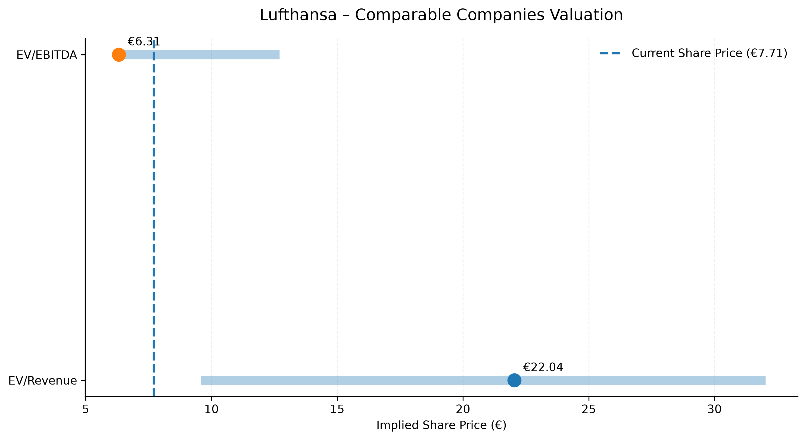
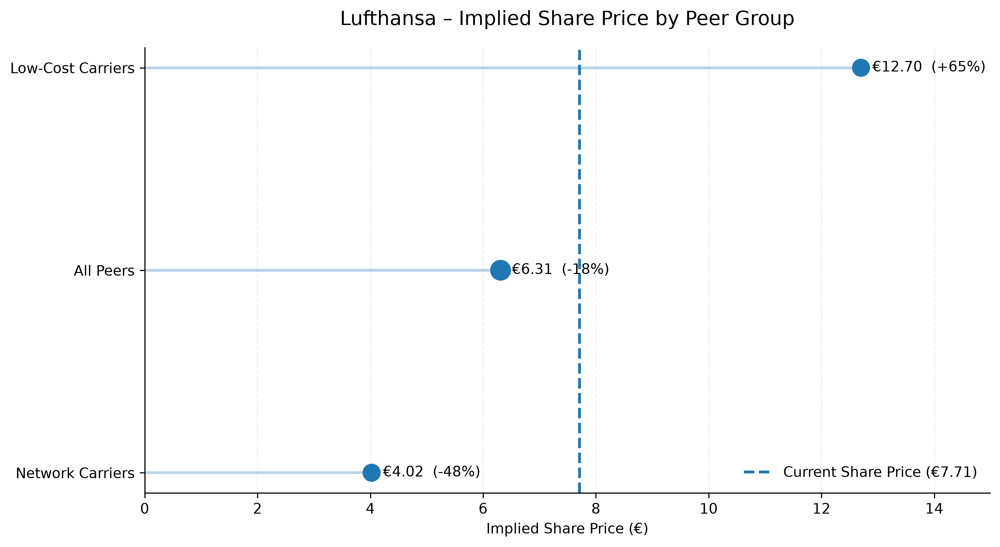

# Lufthansa Trading Comparables Valuation

A Python-based comparable companies analysis of Deutsche Lufthansa AG using a selected peer group of European network and low-cost carriers.

The project applies a trading comparables methodology to derive an implied equity valuation for Lufthansa based on LTM financials, enterprise value and peer trading multiples.

## Project Overview

**Target:** Deutsche Lufthansa AG  
**Valuation Date:** 9 September 2026  
**Primary Valuation Method:** EV / LTM EBITDA

### Peer Group

- Air France-KLM
- International Airlines Group (IAG)
- easyJet
- Ryanair
- Wizz Air

The peer group is further classified into **Network Carriers** and **Low-Cost Carriers** to analyze the impact of business-model selection on Lufthansa's implied valuation.

## Key Valuation Results

| Valuation Basis | Implied Share Price |
|---|---:|
| Network Carriers | €4.18 |
| All Peers | €6.55 |
| Low-Cost Carriers | €12.83 |

At the valuation date, Lufthansa traded at approximately **€7.86 per share**. The median EV / EBITDA valuation based on the full peer group therefore implies approximately **17% downside**.

The significant valuation dispersion demonstrates the importance of peer selection when applying trading comparables to airlines.

## Valuation Overview

The football field below summarizes the implied Lufthansa share-price ranges derived from EV / Revenue and EV / EBITDA trading multiples.



The analysis shows the valuation dispersion across different trading multiples and highlights the current Lufthansa share price relative to the implied peer-based valuation range.

## Methodology

The analysis follows the standard trading comparables valuation framework:

1. Select a relevant peer group
2. Construct LTM Revenue and EBITDA
3. Retrieve share prices as of the valuation date
4. Calculate Equity Value
5. Add Net Debt to derive Enterprise Value
6. Calculate EV / Revenue and EV / EBITDA trading multiples
7. Determine peer-group quartiles and median multiples
8. Apply peer multiples to Lufthansa's LTM financials
9. Convert implied Enterprise Value into Equity Value
10. Derive an implied share price

The project also performs a **peer-group sensitivity analysis** comparing network carriers, low-cost carriers and the full peer group.

### Implied Share Price by Peer Group

The chart below illustrates the sensitivity of Lufthansa's implied share price to the selected peer-group composition.



The significant difference between network carriers and low-cost carriers demonstrates the importance of peer selection in a comparable companies analysis.

## Key Features

- LTM financial statement construction
- Historical share-price retrieval
- GBP / EUR currency normalization
- Equity Value and Enterprise Value calculation
- EV / Revenue and EV / EBITDA trading multiples
- Peer median and quartile analysis
- Implied share-price valuation
- Football-field valuation visualization
- Reproducible Python workflow
- Business-model-based peer-group sensitivity analysis

## Repository Structure

```text
lufthansa-trading-comps/
│
├── README.md
├── requirements.txt
├── .gitignore
│
├── notebooks/
│   └── lufthansa_comps_analysis.ipynb
│
└── outputs/
    ├── football_field.png
    └── peer_group_valuation.png
```

## Data Sources

Financial information is based on publicly available company annual and interim reports available as of the valuation date.
Market data, including historical share prices and foreign-exchange rates, is retrieved programmatically using the yfinance Python package.
The analysis covers:
- Deutsche Lufthansa AG
- Air France-KLM
- International Airlines Group
- easyJet
- Ryanair
- Wizz Air

Financial periods differ across companies due to different fiscal year-ends. LTM figures are therefore constructed using the latest publicly available financial information available as of the valuation date.

## Limitations

Trading comparables provide a relative, market-based valuation and should not be interpreted as an intrinsic valuation.
Key limitations include differences in:
- Business models and route networks
- Fiscal year-ends
- Profitability and cost structures
- Accounting policies
- Net debt definitions
- Lease and pension treatment
- Capital structures

The analysis therefore uses EV / EBITDA as the primary valuation reference and evaluates the impact of different peer-group definitions.

## Technologies

- Python
- pandas
- NumPy
- Matplotlib
- yfinance
- Jupyter Notebook

## Disclaimer

This project was created for educational and portfolio purposes only. It does not constitute investment advice or a recommendation to buy or sell any security.    