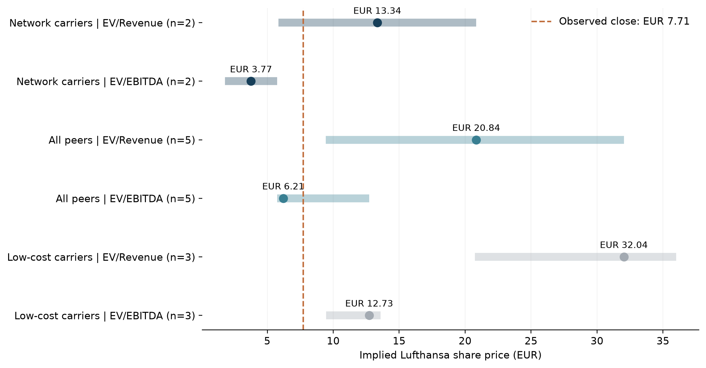

# Lufthansa Trading Comparables Valuation

**Valuation date: 9 September 2026 | Educational valuation case study**

This project values Lufthansa using European airline trading multiples, with auditable financial bridges, issuer source references and a frozen market-data snapshot. It illustrates valuation work relevant to M&A; it does not model a transaction or claim prior deal experience.

## Main finding

Peer choice matters more than the appearance of numerical precision. The network-carrier EBITDA reference midpoint is EUR 3.77 per share, compared with EUR 6.21 for all five peers and EUR 12.73 for the low-cost set. The observed Lufthansa close is EUR 7.71. These are outputs of a **reported-net-debt baseline**, not fully adjusted target prices. Network carriers are the primary business-model reference; only two core peers are available.

| group | n | low | median | high | range_basis |
| --- | --- | --- | --- | --- | --- |
| Network carriers | 2 | 1.78 | 3.77 | 5.75 | Observed min-max |
| All peers | 5 | 5.75 | 6.21 | 12.73 | Peer 25th-75th percentile |
| Low-cost carriers | 3 | 9.47 | 12.73 | 13.59 | Peer 25th-75th percentile |

The two-company range is the observed min-max. Larger groups use peer 25th-75th percentiles, which are not confidence intervals. EV/Revenue is secondary because margins and business mixes differ materially.



## Read first

- [Three-page valuation brief](outputs/Lufthansa_Valuation_Brief.pdf)
- [Methodology and limitations](docs/METHODOLOGY.md)
- [German interview guide](docs/INTERVIEW_GUIDE_DE.md)
- [Notebook](notebooks/lufthansa_comps_analysis.ipynb)

## Run

Python3.12 is recommended. From the project directory:

```sh
python -m pip install -r requirements.txt
python src/valuation.py
python tests/test_valuation.py
```

Open the notebook in JupyterLab and Run All. No network access is required for the valuation: prices and source inputs are frozen under `data/`. Running the valuation updates CSVs, chart and summary.json. To refresh the README, PDF and notebook's saved outputs from that same run, use `python src/build_deliverables.py`. The report builder uses reportlab; it does not require the local-only preparation scripts.

## Data and audit trail

`data/ltm_bridges.csv` contains FY/interim components, period ends, report IDs, page locations and known disclosure differences. `data/net_debt_bridges.csv` reconciles debt and cash. `data/companies.csv` records share-count dates, sources and conventions. `data/source_registry.json` lists issuer reports and issuer-authored announcements. `data/market_snapshot.csv` and `data/market_raw/` preserve actual unadjusted closes and the provider response. Source links point to third-party publications; original reports are not bundled.

## Improvements from the original

- Corrected IAG issued shares for disclosed treasury holdings.
- Rebuilt Ryanair lease-inclusive net debt from the balance sheet instead of rounded net cash.
- Used explicit company-reported Wizz Air rolling EBITDA; retained the unexplained EUR1.3m bridge difference in the audit trail.
- Removed manual README results; all reported values now come from the same model output.
- Added assertions against missing values, future dates, duplicate rows and broken LTM arithmetic.
- Used consistent spot FX for GBP amounts; identified pence conversion explicitly.
- Added leave-one-out, EBITDA/multiple, Ryanair exceptional-charge and expanded EV-bridge sensitivities.

## Limits that remain

AF-KLM revenue uses a provisional bridge across original FY and IFRS18-restated interim comparatives. easyJet is deliberately lagged to H1 and has offer-related price risk. Some share counts are issued-share proxies or older disclosures, not exact-day outstanding counts. EBITDA definitions differ. The expanded EV-bridge scenario uses book proxies for selected pensions, minority interests and perpetuals; it is not a complete fair-value harmonization. These constraints matter and are explained in the methodology, not hidden behind a precise share price.

The `original/` folder preserves the user's initial version for comparison. The revised case study was researched and developed collaboratively with AI assistance. The candidate should personally verify and understand all assumptions before using it as an interview work sample.
